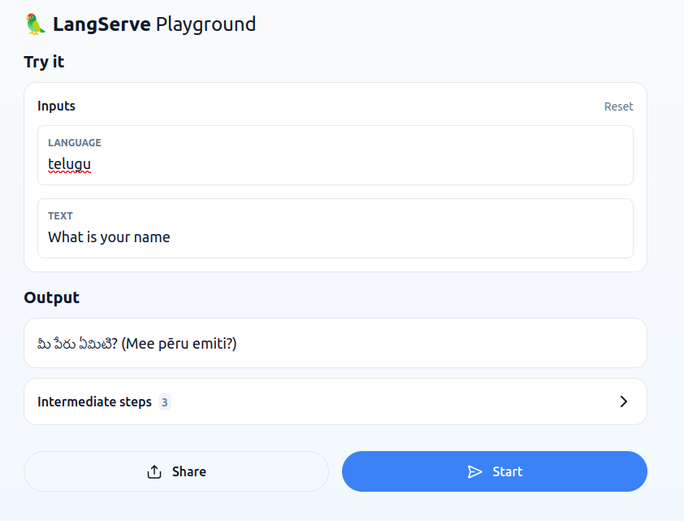

# Local Text Translation Using Llama3

A simple text translation from English to any target language, implemented using the Langchain, Ollama, Docker.

## Table of Contents
- [Without Docker](#without-docker)
  - [Installation](#installation)
  - [Usage](#usage)
  - [Example](#example)
- [With Docker](#with-docker)
  - [Installation](#installation-1)
  - [Usage](#usage-1)
  - [Example](#example-1)
- [Miscellaneous](#miscellaneous)

## Without Docker

### Installation

1. Clone the repository:
   ```bash
   git clone https://github.com/vamsikumbuf/local-text-translation.git
   cd local-text-translation
   ```

2. Create a virtual environment:
   ```bash
   python3 -m venv venv
   source venv/bin/activate
   ```

3. Install the required packages:
   ```bash
   pip install -r requirements.txt
   ```

4. Download and set up [Ollama](https://www.ollama.com/) :
    ```
    curl -fsSL https://ollama.com/install.sh | sh
    ollama serve
    ```
5. Install any Llama Model using Ollama:
	```bash
	ollama run llama3 # installs 8B params version
	```
	- Don't forget to keep ollama server running in the background


### Usage

1. Start the application:
   ```bash
   python main.py --model_name=llama3 --model_name=localhost
   ```

2. Interact with the text translation service:
   - The service takes input text in English and outputs the translated text in the target language.
   - Test the application at [Langchain Playground](http://localhost:8000/chain/playground/)

### Example



## With Docker

### Installation

1. Create a common network for ollama server and client.
    ```
    docker network create llm_network
    ```
2. Run the [Ollama Docker Image](https://ollama.com/blog/ollama-is-now-available-as-an-official-docker-image)
    ```bash
    # Only CPUs
    docker run -d -v ollama:/root/.ollama -p 11434:11434 --hostname ollama-container --network llm_network --name ollama ollama/ollama
    ```

    ```bash
    # With gpus
    docker run -d --gpus=all -v ollama:/root/.ollama -p 11434:11434 --hostname ollama-container --network llm_network --name ollama ollama/ollama
    ```
3. Build the client Image
    ```bash
    # from the repo's directory
    docker build -t ubuntu .
    ```
4. Run the client container
    ```bash
    docker run -p 8000:8000 --network llm_network -it ubuntu bash

    # within the container
    python main.py --model_name=llama3 --model_host=ollama-container
    ```

### Usage

1. The Ollama server will be running and the client container will interact with the server for text translation tasks.
2. Interact with the text translation service:
   - The service takes input text in English and outputs the translated text in the target language.
   - Test the application at [Langchain Playground](http://localhost:8000/chain/playground/)

### Example


## Miscellaneous
### Using host models within container
- If you already had your models downloaded in your local machine, and if you want to use same model inside the docker container then you can specify the model location as the mounted volume when you run the ollama server
    ```
    docker run -d -v model_dir_path:/root/.ollama -p 11434:11434 --hostname ollama-container --network llm_network --name ollama ollama/ollama
    ```
- By default ollama models get downloaded to `/usr/share/ollama/.ollama` directory
### Hostname
- When you run the python script through the client container don't forget to use the same hostname, given when you instantiate the ollama server